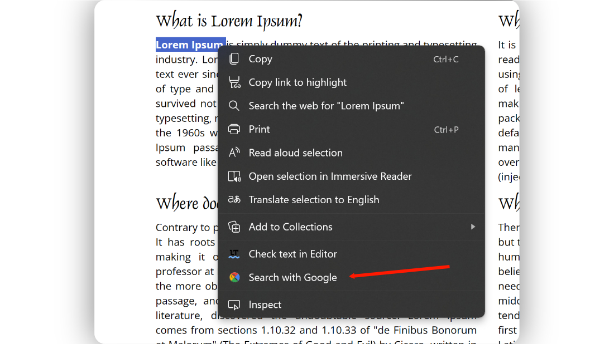

    

# GSearch

A Chrome/Edge Addon to add Google search option to the right-click menu.

    

#### To use this Addon:
> 1. Download the latest [release](https://github.com/kbkozlev/GSearch/releases)
> 2. Extract the contents of the zip file.
> 3. Open Chrome or Edge and navigate to the extensions tab.
> 4. Enable 'Developer Mode'
> 5. Click on 'Load unpacked' and select the addon.
