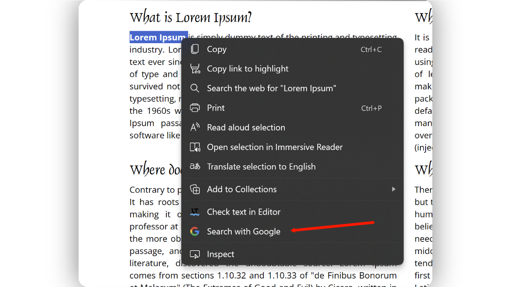

# googleSearch

A Chrome/Edge Addon to add Google search option to the right-click menu.

 

#### To use this Addon:
> 1. Download the latest <a href="https://github.com/kbkozlev/googleSearch/releases">release</a>
> 2. Open Chrome or Edge and navigate to the extensions tab.
> 3. Enable 'Developer Mode'
> 4. Click on 'Load unpacked' and select the addon.

